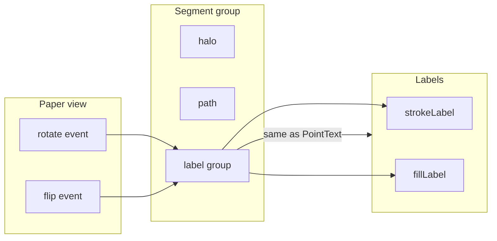

# Plan: Ruler labels upright like PointText

Make ruler measurement labels stay upright and readable when the slide is rotated or flipped, by counter-rotating only the labels (matching PointText) while leaving the measurement line in paper/image space.

---

## 1. Differences: PointText vs Ruler

**PointText** ([paperitems/pointtext.mjs](src/js/paperitems/pointtext.mjs)) keeps text readable by counter-rotating the **entire** group (circle + text):

- The group listens to the Paper **view** (`point.view`) for `rotate` and `flip`.
- **On rotate:** `point.rotate(-ev.rotatedBy)` so the group cancels the view’s rotation.
- **On flip:** Local `handleFlip()`: rotate by `-angle`, scale `(-1, 1)`, rotate by `angle` (angle depends on `view.getFlipped()` and `view.getRotation()`).
- **Initial state:** If flipped, call `handleFlip()`; then `offsetAngle = getFlipped() ? 180 - getRotation() : -getRotation()`; `point.rotate(offsetAngle)`.

The view’s rotation and flip are synced from the OpenSeadragon viewport in [paper-overlay.mjs](src/js/paper-overlay.mjs); events are emitted from [paper-extensions.mjs](src/js/paper-extensions.mjs).

**Ruler** currently does none of this: segment groups are `[halo, path, strokeLabel, fillLabel]` in paper space, so when the view rotates or flips, labels rotate with the slide. The **line** should keep rotating with the slide; only the **labels** should stay upright like PointText.

---

## 2. Approach (aligned with PointText)

1. **Wrap labels in a group**  
   Segment group becomes `[halo, path, labelGroup]` where `labelGroup` contains `[strokeLabel, fillLabel]`. Constants: `SEGMENT_HALO = 0`, `SEGMENT_PATH = 1`, `SEGMENT_LABEL_GROUP = 2`; inside label group: stroke index 0, fill index 1.

2. **Label group setup (mirror PointText)**  
   - `labelGroup.pivot = new paper.Point(0, 0)`; `labelGroup.applyMatrix = true`.
   - Label group **position** = placement center (in segment/paper space).
   - Both PointTexts **inside the label group** have `point: new paper.Point(0, 0)` and `justification: 'center'` so they sit at origin in group space. Rotation then happens around the placement center.

3. **Counter-rotate the label group (same pattern as PointText)**  
   In both [ruler.mjs](src/js/papertools/ruler.mjs) and [rulermeasurement.mjs](src/js/paperitems/rulermeasurement.mjs), **inline** the same block PointText uses (no shared helper). Use `labelGroup.view` for view access. Exact block to replicate:

   ```javascript
   function handleFlip(){
       const angle = labelGroup.view.getFlipped() ? labelGroup.view.getRotation() : 180 - labelGroup.view.getRotation();
       labelGroup.rotate(-angle);
       labelGroup.scale(-1, 1);
       labelGroup.rotate(angle);
   }
   if (labelGroup.view.getFlipped()) {
       handleFlip();
   }
   const offsetAngle = labelGroup.view.getFlipped() ? 180 - labelGroup.view.getRotation() : -labelGroup.view.getRotation();
   labelGroup.rotate(offsetAngle);

   labelGroup.view.on('rotate', ev => {
       const angle = -ev.rotatedBy;
       labelGroup.rotate(angle);
   });
   labelGroup.view.on('flip', () => {
       handleFlip();
   });
   ```

4. **No listener cleanup**  
   PointText does not remove its view listeners when the item is removed. Do not add `segmentGroup.on('remove')` or view.off; match PointText for consistency.

5. **Where to apply**  
   - **ruler.mjs:** In `buildSegmentGroup`, create the label group, add both PointTexts to it at (0,0) in group space, add label group as third child. After the segment group is in the project (e.g. in `_ensurePathLabel` or immediately after adding the segment group), set label group position to placement center, then run the block above. In `_ensurePathLabel`, update label content and **label group position** (labels stay at (0,0) in group space). Apply the same logic to the **preview** segment group so preview text stays upright.
   - **rulermeasurement.mjs:** In `buildSegmentGroupFromPath`, same 3-child layout with label group; set label group position to **midpoint** (no “above segment” offset for loaded data). After building, run the same inline rotate/flip block so loaded measurements have upright labels.

6. **Call sites**  
   Every use of `segmentGroup.children[SEGMENT_STROKE_LABEL]` / `[SEGMENT_FILL_LABEL]` becomes `segmentGroup.children[SEGMENT_LABEL_GROUP].children[0]` and `.children[1]` (or local constants). Update `_getPathFromSegmentChild`, hit-test, and any style/selection code that indexes segment children.

---

## 3. Implementation summary

| File | Change |
|------|--------|
| **ruler.mjs** | Constants: 3 children, `SEGMENT_LABEL_GROUP = 2`. `buildSegmentGroup`: create label group, add stroke and fill labels at (0,0) in group space, add label group as third child. After adding segment to item (and in preview path), set label group position (from `_computeLabelPlacementCenter`), then inline handleFlip + offsetAngle + view.on('rotate'/'flip'). `_ensurePathLabel`: use `children[SEGMENT_LABEL_GROUP].children[0/1]`, update content and **label group position**; labels’ `point` stays (0,0). All other segment-child index uses updated. |
| **rulermeasurement.mjs** | Same 3-child layout in `buildSegmentGroupFromPath`; label group contains stroke and fill labels at (0,0). Label group position = **midpoint**. After building the group, run the same inline rotate/flip block. Constants aligned with ruler.mjs. |

---

## 4. Flow



---

## 5. Edge cases

- **Preview segment:** Same label-group + view logic so preview text stays upright.
- **Initial state:** When the view is already rotated or flipped at creation/load, the inline block applies it (handleFlip + offsetAngle) so labels are upright immediately.
- **RulerMeasurement:** Use midpoint for label group position; no duplication of “above segment” offset.
